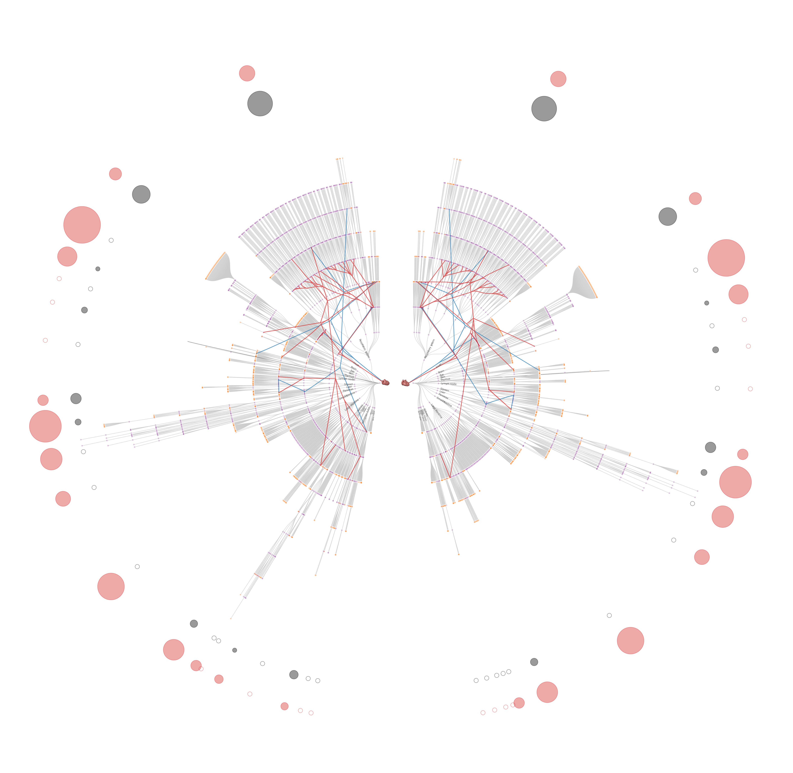

# Human-Reference-Atlas

The goal of the project is to visualize the hierarchical network of body parts (anatomical structures) and cell types. The network is a branching tree, in the center there is the “body” then the next layer is the organs (e.g., brain, liver, and heart) and then the next layer is the subparts of these organs, the next layer consists of the subparts of the subparts and so on. 
The left wing shows the organs of a female body and the right wing shows the organs of a male body. 

The second layer of the visualization is the vascular network. We have checked those nodes that match (i.e., that are present in both the vascular data and the ASCT+B tables). The vascular network is pruned at these matching nodes, moreover, we visualized the network using the spring layout (Fruchterman-Reingold force-directed algorithm). To be able to overlay the two visualizations, we fixed the coordinates of the matching nodes. The vascular network is also a branching tree but to make it look more natural, like arteries and veins, we used a kernel density estimation-based edge bundling algorithm. 

The final step of the visualization is to put together these networks, or in other words, to layover the vascular network on the body network. That can be done in Illustrator. 

To sum up, the problem consists of three main tasks: 
  1. Visualization of the body network (hierarchical network of anatomical structures and cell types): we used Vega's [radial tree layout](https://vega.github.io/vega/examples/radial-tree-layout/) 
  2. Visualization of the vascular network (the positions of some nodes are fixed): we used networkx's [spring layout](https://networkx.org/documentation/stable/reference/generated/networkx.drawing.layout.spring_layout.html) and datashader's [edge bundling algorithm](https://datashader.org/user_guide/Networks.html)
  3. Overlay the vascular network on top of the body network, additional simpler visualizations, legends, captions, hearts.
