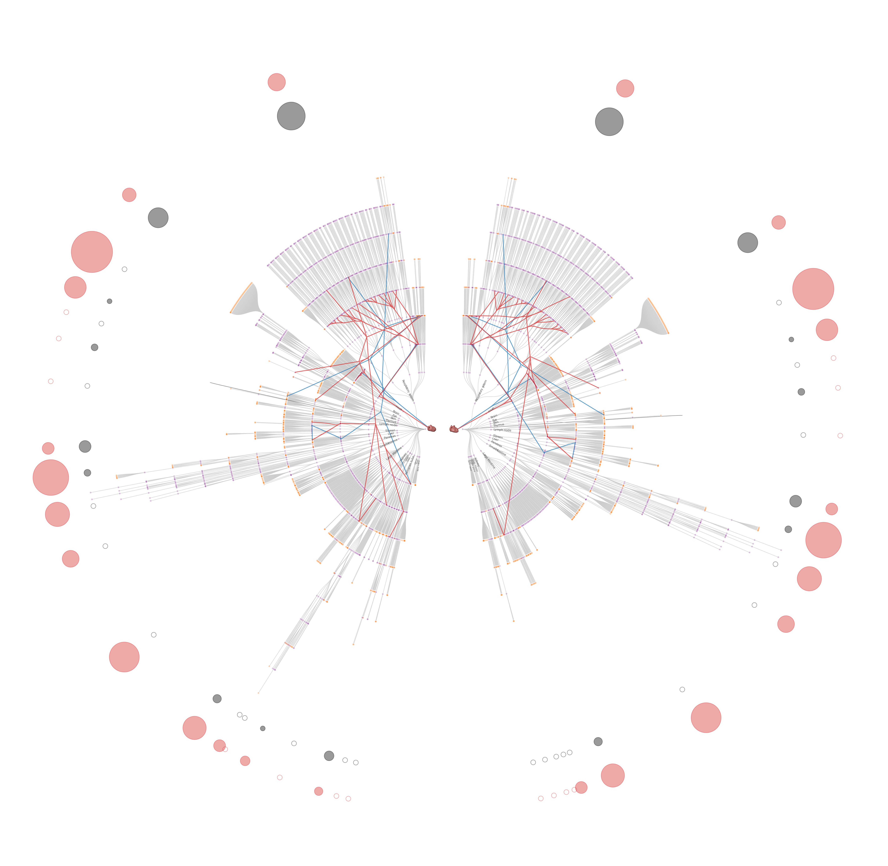

# Human-Reference-Atlas

The goal of the project is to visualize the hierarchical network of body parts (anatomical structures) and cell types. The network is a branching tree, in the center there is the “body” then the next layer is the organs (e.g., brain, liver, and heart) and then the next layer is the subparts of these organs, the next layer consists of the subparts of the subparts and so on. There are some female/male specific organs, so there would be two networks, one corresponding to the female body, and the other would be the male body. 

Once we have these networks in a radial tree layout and we have the coordinates of the nodes saved, then the next step is to visualize the network of the vascular system (i.e., the network of arteries). There are some nodes that are present in both the body network and in the vascular network. The difficulty of visualizing the vascular network is that we have to fix the positions of those nodes that are also in the body network. Their coordinates should be the same as in the other network visualization. The vascular network is also a branching tree but we should visualize it with bundled edges so they look more natural, like arteries and veins. 

The final step of the visualization is to put together these networks, or in other words, to layover the vascular network on the body network. That can be done in Illustrator. 

To sum up, the problem consists of three main tasks: 
  1. Visualization of the body network (hierarchical network of anatomical structures and cell types)
  2. Visualization of the vascular network (the positions of some nodes are fixed)
  3. Overlay the vascular network on top of the body network, additional simpler visualizations, legends, captions.
